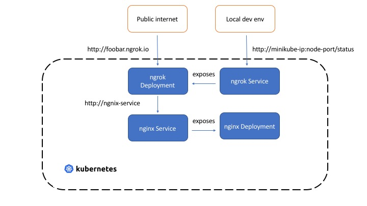

## Expose Kubernetes services with `ngrok`

Very often, there is a need to expose Kubernetes apps running in [minikube](https://kubernetes.io/docs/setup/minikube/) to the public internet. This post just provides a manual, yet quick and dirty hack for this using [ngrok](https://ngrok.com/).

We'll use a simple [nginx](https://www.nginx.com/) app to test things out i.e. we'll expose an nginx server (running as a single replica Kubernetes Deployment) as a publicly accessible URL.

For details, check out [the blog](https://medium.com/@abhishek1987/expose-kubernetes-services-with-ngrok-65280142dab4)

